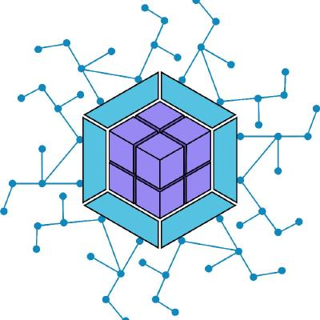

<div align="center">
  

  # Micro-frontend - Module Federation

   
  
  

</div>

<p align="center">
  Workshop on a web application using a micro-frontend architecture and a monorepo. My main objective is to learn how to use the webpack 5 federation module plugin and what are the considerations, pros and cons when using this architecture. 
</p>

<p align="center">
  The container, auth and landing projects are built with react v18, while the dashboard is built with vue.js v3.
</p>

## Installation

To clone and run this application, you'll need [Git](https://git-scm.com) and [Node.js](https://nodejs.org/en/download/) (which comes with [npm](http://npmjs.com)) installed on your computer.

From your command line:

```bash
# Clone this repository
$ git clone https://github.com/DavidBarcenas/microfrontend.git

# Go into the repository
$ cd microfrontend

# install dependency for each project
$ cd auth && npm install
$ cd container && npm install
$ cd dashboard && npm install
$ cd landing && npm install
```

## Running the app

To develop each project separately, you just have to access the folder of the project you want to work on.

```bash
# Go into auth, dashboard, landing
$ cd auth

# Run the app
$ npm start
```

To see the implementation of all the projects together, access the `container` folder.

**Note: it is important that all projects are running on their corresponding port so that we can see the full functionality.**

```bash
# Go into container
$ cd container

# Run the app
$ npm start
```

## Deployment

Production applications will be found in a folder called `dist` (for each project) after running the following command.

```bash
# Command to build production app
$ npm build
```

Depending on where you want to host your application, you will need to change the domain settings in the `config/webpack.prod.js` file in the `container` folder to have a correct application deployment.

## License
Released under the  [MIT licensed](LICENSE).\
Feel free to fork this project and improve it. Give a ⭐️ if you like this project!